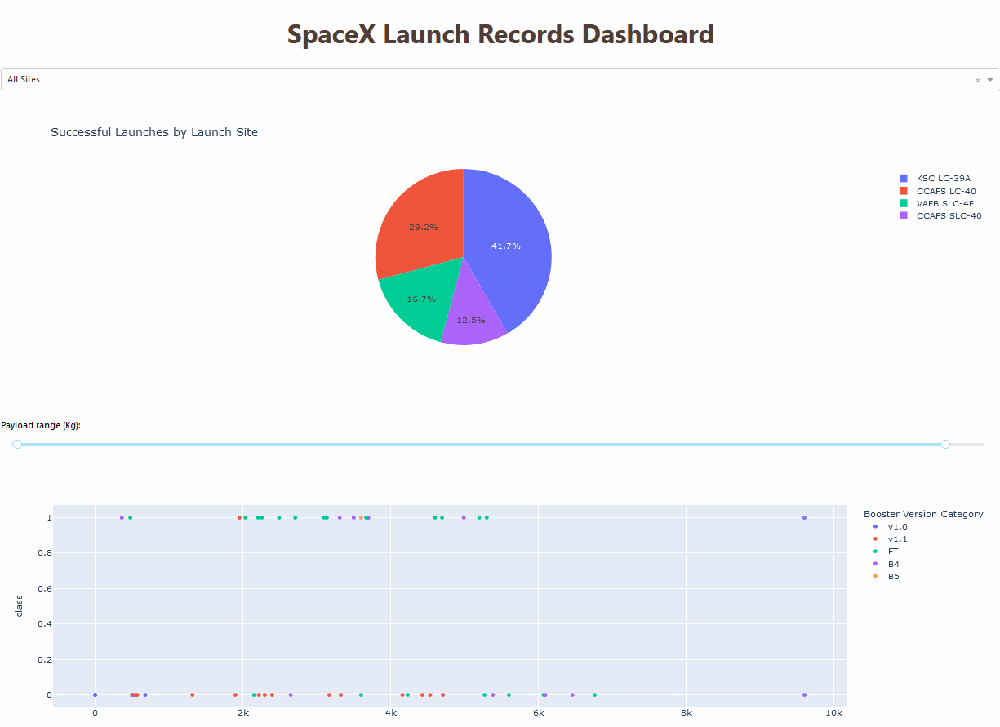

# Capstone Project - SpaceX Falcon 9 Launches Prediction

The aim of these exercise is to investigate  if the Falcon 9 first stage will land successfully.

SpaceX advertises Falcon 9 rocket launches on its website with a cost of 62 million dollars; other providers cost upward of 165 million dollars each, much of the savings is because SpaceX can reuse the first stage. Therefore if we can determine if the first stage will land, we can determine the cost of a launch.

For the exercises, we will go through what we have learnt ranging from gathering data, data wrangling, SQL, Dash and Plotly to machine learning.

## Data Description
The dataset includes the following variables:
1. **FlightNumber**: The Flight Number attempt
2. **Date**: The Date of the launch in YYYY-MM-DD
3. **BoosterVersion**: The booster version used for the launch
4. **PayloadMass**: The Payload Mass in KG
5. **Orbit**: The orbit in which the launch is for
6. **LaunchSite**: Where the launch is made
7. **Outcome**: The outcome of the launch. This is in the format of True/ False and the locale
8. **Flights**: Number of Flights made
9. **GridFins**: Whether GridFins are used or not
10. **Reused**: Whether this a a reused flight or not
11. **Legs**: Whether legs are used for the launch or not
12. **LandingPad**: Whether a landing pad is used or not
13. **Block**: The iteration or stage of development of the rocket being used for the launch
14. **ReusedCount**: How many times this has been reused
15. **Serial**: The unique serial ID
16. **Longitude**: Longitude of the location, which corresponds to launch site
17. **Latitude**: Latitude of the location, which corresponds to launch site
18. **Class**: A categorical variable created as binary type as target variable. 1 = Success and 0 = Failure.

## Libraries

The following libraries are used for this project:

```bash
import pandas as pd
```
```
import numpy as np
```
```
import matplotlib.pyplot as plt
import seaborn as sns
```
```
from sklearn import preprocessing
from sklearn.model_selection import train_test_split, GridSearchCV
from sklearn.model_selection import LogisticRegression
from sklearn.svm import SVC
from sklearn.tree import DecisionTreeClassifier
from sklearn.neighbors import KNearestNeighbors
```

## Overview

The project will serve to perform the following objectives

#### Data Collection
- GET request call from SpaceX V4 API to obtain JSON text
- Webscrape from Wikipedia page using BeautifulSoup4
- Convert JSON file to a Python Pandas DataFrame

#### Data Wrangling
- Perform Exploratory Data Analysis (EDA) to find patterns in data and determine label for training supervised models with Pandas
- Perform EDA with SQL using SQLLite to select and sort data
- Visualise relationships with Matplotlib and Seaborn package
- Feature Engineering with OneHotEncoder

#### Interative Visual Analytics
- Build an interactive dashboard with Plotly Dash with pie charts and scatter plots
- Build an interactive map to analyse launch site proximit with Python Folium library with marker clusters

#### Machine Learning
- Use Supervised Learning models such as SVM, Classification Trees and Logistic Regression with GridSearch to find the best hyperparameter

#### Plotly Dashboard


## Contributing

IBM SkillsNetwork
